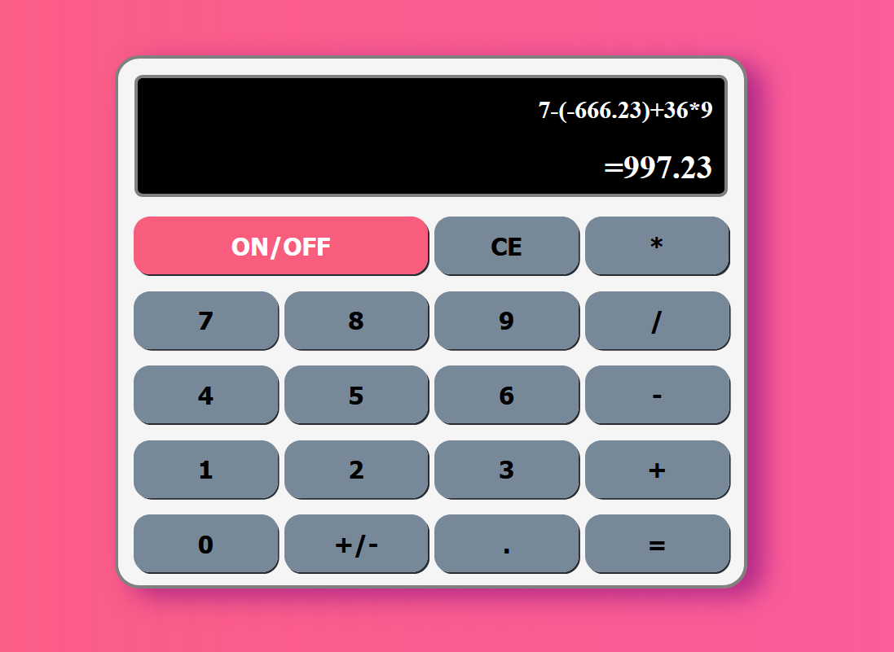

# Digitron

## Digitron/ Calculator

 
 * _The idea of this project was to make fully functional calculator._

 * _Technologies that were used on this project are: HTML, CSS and Vanilla JavaScript._

 
 
 * This is a photo of a calculator (digitron).

 
   

> (Just a note that on the other branch "oldCalculator"
 > is an older (beginner's) version of this project that is outdated.)
